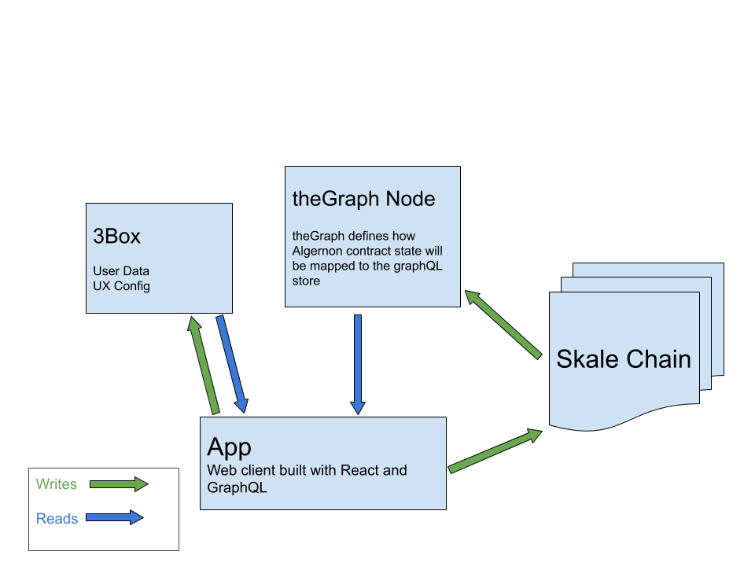

### Algernon

Peer to peer learning network.

Take notes as you learn a topic. Review other users notes. Stake tokens to endorse quality content.

Algernon is a layer 2 blockchain dapp which uses the blockchain as the source of truth data layer and centralized components to improve usability.

## Create Content
allow users to create semi-structured content with some of the data stored directly on chain and the rest of the data stored offchain with a hash of the data stored on chain.

## Curate Content (TCR)
allow users to stake tokens against content to help other users find quality content and to earn additional tokens

## Dapp Components

# skale chain
  - a POS ethereum sidechain offering high throughput and gasless transactions
  
# web/mobile client
  - the user gateway through which users can broadcast transactions to the chain, query the graph-node, and interact with the dapp

# the Graph Protocol
  - Tracks transactions on chain and updates a Postgres db

# Server
 - backend providing connections to different datastores or services

### 3rd Party Libs
  - Graph Protocol
  - Fortmatic

## Running Locally

- configure .env

- install ganache-cli and truffle globally
  - npm install -g ganache-cli truffle

- Start a local ganache instance
  - yarn run-ganache

- Deploy smart contracts to ganache instance
  - yarn deploy-develop

- Run a theGraph Node
  https://thegraph.com/docs/quick-start

- update theGraph/subgraph.yaml with Alergernon contract address from deploy step
- Start the theGraph app
  - cd theGraph/ && yarn create-local deploy-local

- Run the app
  - cd app/ && yarn start

### Data Flow

# Known Issues

## Update Subscriptions
  - After performing a state update the UI does not automatically reflect the change, FIX: reload the page

